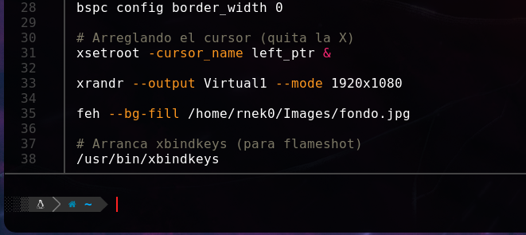

¿ Como crear un atajo de teclado (shortcut) para **Flameshot** y hacer pantallazos solo al pulsar la tecla "Print Screen" ? aquí tenéis los pasos a ejecutar :

### Una breve presentación :

[Flameshot](https://flameshot.org/) es un programa que permite hacer capturas de pantalla, es [Free](https://github.com/flameshot-org/flameshot/blob/master/LICENSE) con [GNU General Public License v3.0](https://www.gnu.org/licenses/gpl-3.0.en.html) & [open source](https://opensource.org/) software. 

[xbindkeys](https://www.nongnu.org/xbindkeys/) es un programa que permite lanzar comandos shell con teclado o con el ratón (mouse).

[bspwm](https://github.com/baskerville/bspwm) es un gestor de ventanas en mosaico que representa las ventanas como las hojas de un árbol binario completo.

### El entorno

El entorno en el que esto esta hecho es una distribución Gnu-Linux [**Parrot**](https://www.parrotsec.org/) con bspwm en una maquina virtual, como se puede aprender en el curso "**Personalización de entorno en Linux**" de la academia [hack4u](https://hack4u.io/cursos/personalizacion-de-entorno-en-linux/).  

Al principio la maquina virtual fue creada con WMware en windows y mas tarde exportada a VirtualBox en Archlinux.

Aqui teneis las etapas para conseguirlo(*). Manos a la obra...

> *Si prefieres solo poner 2 lineas en el /home/${USER}/.config/sxhkd/sxhkdrc* ver [aqui]({{ . }}#Comentarios+finales "2 lineas")

---
<br>

## 1. Instalar xbindkeys

Lo normal en un ambiente Parrot.

```bash
sudo apt update
# sudo parrot-upgrade (si necesario)
sudo apt install flameshot xbindkeys

# Flameshot lo mismo, ya sabeis
sudo apt install flameshot
```

---
<br>

## 2. Comprobamos que xbindkeys y Flameshot estan instalados.

Esto solamente para estar seguros, es opcional.

```bash
$ which xbindkeys
/usr/bin/xbindkeys

$ command -v flameshot
/usr/bin/flameshot
```

command -v para variar de which.

---
<br>

## 3. Configuración del shortcut

**a)** Primero debemos crear un fichero **.xbindkeysrc** en el path : **/home/${USER}**

```echo '' > .xbindkeysrc```

**b)** Ahora buscamos el comando que pondremos en el **.xbindkeysrc**  
Al lanzar este comando : ```xbindkeys --key``` , se abre una ventana y debes pulsar la tecla "Print Screen"

```bash
$ xbindkeys --key
Press combination of keys or/and click under the window.
You can use one of the two lines after "NoCommand"
in $HOME/.xbindkeysrc to bind a key.
"NoCommand"
    m:0x10 + c:107
    Mod2 + Print
```

Después cierras con Ctrl + C

**c)** Copia las 3 ultimas lineas en **/home/${USER}/.xbindkeysrc** para que quede asi :

```bash
# Launch Flameshot
"flameshot gui &>/dev/null & disown"
m:0x10 + c:107
Mod2 + Print
```  
(cambiando "NoCommand" por tu atajo)

Para probar antes de hacer que los cambios sean permanentes.

* Lanza xbindkeys : /usr/bin/xbindkeys
* Test dandole à la tecla “Print Screen”

---
<br>

## 4. Hacer que los cambios sean permanentes

1. Abrir ```/home/${USER}/.config/bspwm/bspwmrc``` y poner dentro estas dos lineas :

```bash
# Arranca xbindkeys (para flameshot)
/usr/bin/xbindkeys
```



### Salir de la session y volver a entrar

```sudo kill -9 -1```

### Probando

> Pulsa en la tecla “Print Screen” y ... 
>
> TADA !!!

Si lo configuraste bien (y tu maquina no salió ardiendo), ya puedes disfrutar de tus capturas de pantalla.  
Si quieres indagar en el tema podrías hacer que solo al darle a un botón de tu ratón funcione igual.

No olvides el man de bspwm, xbindkeys y flameshot.


<br>
<a name="Comentarios+finales"></a>
### Comentarios finales

Si lo quieres hacer solo con [**sxhkd**](https://wiki.archlinux.org/title/Sxhkd) debes poner estas lineas en el **/home/${USER}/.config/sxhkd/sxhkdrc** :

```bash
# Print screen
Print
        flameshot gui &>/dev/null & disown
```

Despues del primer arranque de flameshot, este queda en funcionamiento como se puede apreciar con este commando.  
Si lo quieres cerrar pues le haces un kill.

```bash
❯ ps aux | grep flameshot
rnek0       6045  2.2  2.6 1499540 107460 ?      Sl   14:52   0:03 /usr/bin/flameshot
rnek0       7116  0.0  0.0   6260   648 pts/0    S+   14:55   0:00 grep --color=auto flameshot
```

---
<br>
Mi conclusión :
No hacking, no fun. So Happy Hacking.