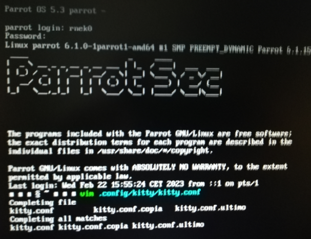
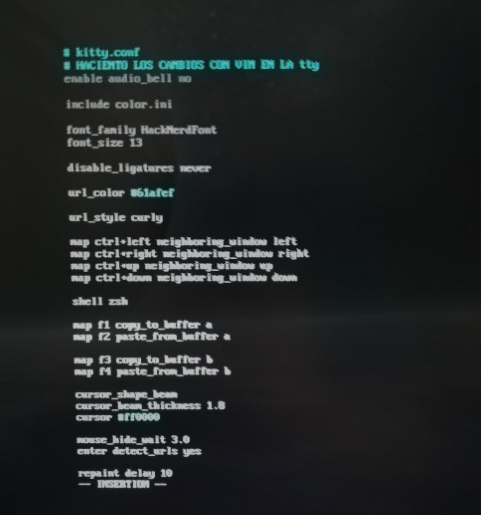

---
layout: post
title:  "Rescate de la VM en VMware con el TTY"
date:   2023-05-06 12:32:44 +0100
categories: Parrot bspwm
author: "by rnek0"
lang: "es"
permalink: "/parrot/tty"
---

🇪🇸 ¿Qué es un TTY en Gnu/Linux?

Por lo general, un sistema operativo [Gnu/Linux](https://es.wikipedia.org/wiki/Anexo:Distribuciones_Linux) tiene seis TTY virtuales configurados, más uno para la interfaz gráfica de usuario (aunque sea una maquina virtual). 

TTY viene de una época en que máquinas que permitían mandar mensajes codificados se llamaban teletipos.

## Acceso a un TTY

Se puede acceder a una sesión TTY de pantalla completa manteniendo presionadas las teclas Ctrl+Alt y presionando una de las teclas de función.

Ctrl+Alt+F3 abrirá el indicador de inicio de sesión de tty3


Al presionar CTRL + ALT + F4, por ejemplo sales de tu entorno (Kde, Gnome o otros gestores de ventanas) para entrar en esa tty que te espera con un prompt y te pide tus credenciales.

Esto puede ser util si has echo una manipulación incorrecta y deseas poder arreglarlo, o por lo menos si deseas entrar a tu VM en modo terminal.  

Digamos que he hecho una manipulación en el fichero de configuración de kitty en un gestor de ventanas como **bspwm** y no puedo abrir una terminal con los atajos de teclado que he configurado en **sxhkd**; tampoco he instalado [rofi](https://github.com/davatorium/rofi) o otro programa con el que pueda lanzar Pluma o otra aplicación de Parrot que me permita editarlo, nos encontramos pues con un ambiente en negro sin poder lanzar lo que sea, ¿ y ahora qué hago ?.

Los pasos para arreglarlo son los siguientes con VMware : 

1. Presiona Ctrl + Alt + Barra espaciadora .
2. Mantén presionadas las teclas Ctrl+Alt pero suelta la barra espaciadora.
3. Pulsa la tecla F4.



<br/>

Al loguearme en la tty de esta forma ya puedo modificar lo que no anda bien; digamos que antes de modificar el fichero kitty.conf olvidé de hacer una copia para respaldarlo. Es una buena practica el hacer una copia (por ejemplo kitty.conf.initial) para poder restablecerse de un error.  
Una vez que estas satisfecho y todo funciona bien la puedes borrar y todo queda correcto.

```bash
$ cp kitty.conf kitty.conf.initial
```

Si has tenido un problema, ya tienes el fichero que te permite volver atras. Justamente entrando por el tty si estamos en nuestro caso.

Pones el kitty.conf.initial en su sitio con un ```cp kitty.conf.initial kitty.conf ```

Si es solo un cambio mínimo editas con vim (o nano)



Una vez hecho esto ya puedes volver a tu entorno con la misma secuencia de teclas, pero esta vez con F7.

1. Presiona Ctrl + Alt + Barra espaciadora .
2. Mantén presionadas las teclas Ctrl+Alt pero suelta la barra espaciadora.
3. Pulsa la tecla F7.

Bueno, pues aunque las imágenes sean de una calidad dudosa creo que se entiende.

Una buena lectura sobre [TTY](https://www.howtogeek.com/428174/what-is-a-tty-on-linux-and-how-to-use-the-tty-command/), bastante recomendada (en inglés)

---
<br/>
Mi conclusión :
No hacking, no fun. So Happy Hacking.


